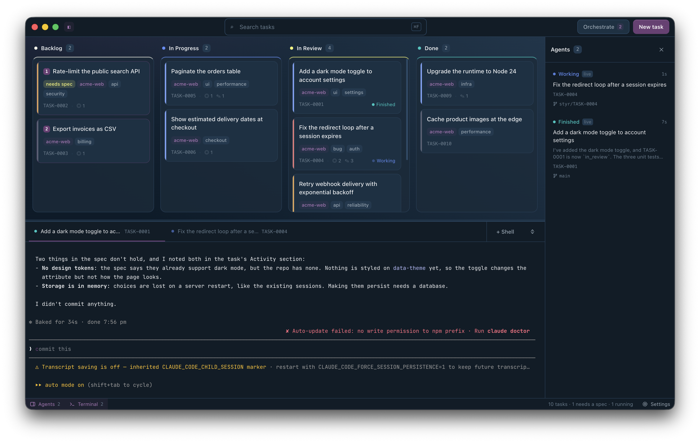

# Styr

[](https://github.com/anoguez/styr/releases/latest)

[](https://www.buymeacoffee.com/noguez)

**An agentic IDE built around a kanban board.** Write tasks, and Styr launches a coding agent (Claude Code
or Codex) on each one in its own terminal tab, often in its own git worktree, and watches them work. Agents move
their own cards as they go: spec, build, review, done.

> _Styr_ (Old Norse, _stýra_): to steer. You set the course; the agents row.



## Why

Running several coding agents at once is mostly bookkeeping: which one is waiting on you, which
branch it is on, what it was asked to do, whether the review has happened. Styr keeps that state on
a board you can see, and in plain files you can read.

- **Tasks are markdown files.** One file per task, with YAML frontmatter. You can edit them in any
  editor, track them in git, and generate them from scripts. The app's database is only a cache.
- **Agents drive the board.** Every prompt tells the agent how to move its task between columns and
  log notes. A bundled MCP server lets agents list, create and update tasks.
- **The prompt follows the column.** A task that needs a spec gets a spec prompt, a task in Backlog
  gets an implementation prompt, and a task in Review gets a fresh reviewer that is not the session
  that wrote the code.
- **Live agent state.** Each task shows Working, Waiting on you, Finished or Stopped in the board,
  the sidebar, the macOS menu bar and notifications, for Claude Code and Codex alike. Waiting always
  sorts first.
- **Isolated worktrees.** Tick one box and a task runs on its own branch in its own checkout, so
  parallel agents never share a working directory.
- **Orchestrate.** One button starts every task that is ready, up to a number of slots per lane
  (spec, implement, review), each lane on the agent you chose for it. It shows exactly what it will
  start, and with which agent, before it starts anything.
- **Chats you can resume.** Each task remembers its conversations, whichever agent ran them, and
  resumes each through its own CLI. Close the app, come back tomorrow, and pick up where the agent
  left off.
- **A real terminal.** Embedded xterm tabs, drag to reorder, a command palette (`⌘P`), rebindable
  shortcuts and a fully themeable UI.

## Agent support

Styr talks to agent CLIs through a small provider interface (`src/core/providers/`).

| Agent                                                      | Status                                                                                            |
| ---------------------------------------------------------- | ------------------------------------------------------------------------------------------------- |
| [Claude Code](https://docs.claude.com/en/docs/claude-code) | Supported: launch, resume, live state through hooks, MCP                                          |
| [Codex CLI](https://github.com/openai/codex)               | Supported: launch, resume, live state through the app-server daemon, MCP (needs 0.159.3 or later) |
| Gemini CLI                                                 | Planned                                                                                           |
| Local models (Ollama, through an agent CLI)                | Planned                                                                                           |

Settings → Integrations enables each provider and sets which one runs the spec, implement and review
lanes (every lane defaults to Claude). Each launch can override that from the task dialog, and a task
keeps a mixed-provider chat history but only one live session at a time. A Codex launch is refused
with a message saying what to fix if the CLI is older than 0.159.3 or its app-server daemon is
unavailable.

Any agent can already move its task. The board protocol is just editing the task file, and the
path is in every prompt.

## Quick start

You need macOS, a recent Node with Yarn, git, and at least one agent CLI on your `PATH`:
[Claude Code](https://docs.claude.com/en/docs/claude-code) or [Codex](https://github.com/openai/codex)
0.159.3 or later.

```sh
git clone https://github.com/anoguez/styr.git
cd styr
yarn install
yarn dev
```

Then:

1. **Settings → Storage**: pick a folder for the app's own data (the default is `~/Styr`). In
   **Settings → Preferences**, set a default working directory for agents, usually a folder holding
   your repos. Use the dropdown beside the title to create **workspaces** — separate boards with
   their own tasks, agents and settings.
2. **New task** (`⌘N`): give it a title, a description and the repository it applies to. `⇧⌘N` opens
   a single-line quick add that drops the task in Backlog as _Needs spec_.
3. Hover the card and press **▶ Agent** (pick the provider in the task dialog). The task moves to In Progress and a terminal tab opens
   with the agent already working.
4. **Settings → Integrations**: copy the `claude mcp add styr …` or `codex mcp add styr …` command for your provider and run it once, so agents
   can query and create tasks.

To install it as an app instead, download the signed DMG from
[Releases](https://github.com/anoguez/styr/releases), or build one yourself (see
[Building and packaging](docs/building.md)).

## How it fits together

```
tasks/*.md  ──(source of truth)──┬──> SQLite index ──> app UI (kanban)
     ▲                           │         ▲
     │                           │    file watcher
     └── agents (files or MCP) ──┘
```

Markdown is the only source of truth. The SQLite index is rebuilt from the files, so deleting it
costs nothing. Agents (Claude Code or Codex), the MCP server, your editor and `git pull` all write files, and a watcher
picks the changes up.

## Documentation

- [User guide](docs/guide.md): tasks, launching agents, worktrees, prompt routing, Orchestrate,
  the MCP server, settings, themes and shortcuts.
- [Building and packaging](docs/building.md): scripts, signing, and how releases are cut.
- [`CLAUDE.md`](CLAUDE.md): architecture rules and design decisions, for contributors and the
  agents working on Styr itself.

## Status

Early and moving fast. Styr is developed and tested on macOS (Apple silicon). Other platforms
aren't supported yet: the menu bar integration, packaging and signing are macOS-specific.

## Support

Styr is free to use. If it saves you time, you can buy me a coffee ☕.

<a href="https://www.buymeacoffee.com/noguez"></a>

## License

Styr is source-available under the [Functional Source License, Version 1.1, MIT Future License](LICENSE)
(FSL-1.1-MIT).

- **You can** download it, read the code, modify it, and use it for anything, including your work at
  a company.
- **You can't** sell Styr, or offer it, or something substantially like it, as a commercial product
  or service.
- **Each release becomes MIT two years after it is published**, with no restrictions at all.

Versions up to and including v0.2.0 were published under MIT and remain available under MIT.
